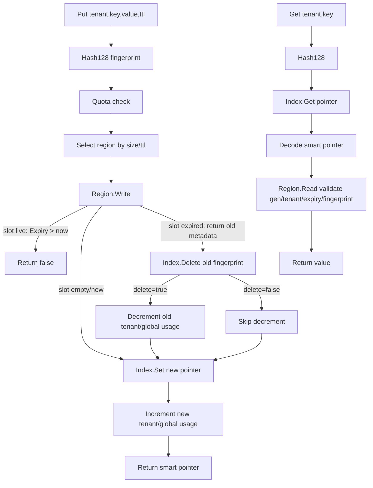

# Cache Architecture (Current Implementation)

This document describes the **current** cache behavior implemented under `internal/cache`.

## 1) High-level design

The cache is a bounded in-memory system with:

- **Fixed memory regions** split by `SizeClass × TTLTier`
- **Sharded hash index** for key → smart pointer lookup
- **Per-tenant usage accounting** + global accounting
- **Expired-slot overwrite cleanup** to keep index/accounting consistent

At startup, memory is preallocated; runtime does not create new regions.

---

## 2) Core components

### `CacheManager`

Responsibilities:

- routes writes to region (`sizeClass`, `ttlTier` selection)
- owns the lookup index
- enforces per-tenant limit
- tracks per-tenant/global used bytes
- coordinates overwrite cleanup when an expired slot is reused

### `Region`

A circular byte arena for one `sizeClass × ttlTier` pair.

Each record is:

- `EntryHeader` (**32 bytes**) + `value`

Header fields include expiry, value length, generation, tenant ID, fingerprint.

### `LookupIndex`

- 1024 shards (`ShardCount`)
- open addressing over `[]uint64`
- 4 slots/bucket (`SlotsPerBucket`)
- writer operations (`Set`, `Delete`) are shard-locked
- reads (`Get`) are lock-free against current shard table pointer

---

## 3) Write flow (`Put`)

1. Build 128-bit fingerprint from `(tenantID, key)`.
2. Compute `entrySize = 32 + len(value)`.
3. Check tenant quota (`tenantLimit`).
4. Select region by size class and ttl tier.
5. `Region.Write(...)` attempts insert:
   - if target slot has non-expired entry (`Expiry > now`) → fail write
   - if slot had expired entry (`Expiry != 0`) → return old metadata (`fingerprint, tenantID, valueLen`)
6. If old metadata exists:
   - delete old fingerprint from index
   - decrement usage **only if delete actually removed index entry**
7. Insert new pointer in index.
8. Increment tenant/global accounting for new entry.

---

## 4) Read flow (`Get`)

1. Build fingerprint.
2. Lookup pointer in index.
3. Decode smart pointer `(tag, classID, tierID, generation, offset)`.
4. Region validates generation, tenant, expiry, fingerprint.
5. Return value bytes.

---

## 5) Accounting rules (current)

- Insert increments by `32 + len(value)`.
- Expired overwrite decrements old owner by `32 + oldValueLen` only if index deletion succeeded.
- Then new entry increments current tenant/global.

This prevents duplicate decrements when the old index entry was already removed.

---

## 6) Current data-flow diagram

---

## 7) Notes and limitations

- Index currently uses tombstones on delete.
- If neighborhood is saturated, `Set` can fail (no runtime resize path implemented in current code).
- Region overwrite checks one slot at current write position; non-expired data at that position blocks write.

