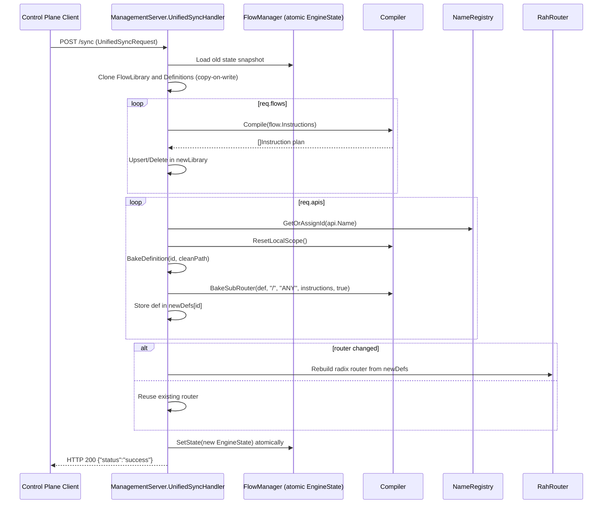

# Unified Sync API/Flow Registration and Runtime Consumption

This document explains how a customer-provided `/sync` payload is transformed into runtime routing and executable flow plans.

## Sequence Diagram

## Method-by-Method Logic

### 1) `UnifiedSyncHandler`
- Validates method (`POST`) and parses JSON into `UnifiedSyncRequest`.
- Loads old atomic state snapshot from `FlowManager`.
- Clones `FlowLibrary` and `Definitions` for copy-on-write updates.
- Compiles each flow update using `Compiler.Compile` and updates `newLibrary`.
- For each API update:
  - Gets stable API id from `NameRegistry`.
  - Builds an `ApiDefinition` with normalized path.
  - Links the compiled flow plan using `Compiler.BakeSubRouter`.
  - Stores definition in `newDefs`.
- Rebuilds router only if API routes changed.
- Atomically swaps in the newly assembled `EngineState`.

### 2) `Compiler.Compile`
- Resets compiler-local instruction table and slot state.
- Flattens flow steps into executable `[]Instruction`.
- Returns the compiled plan.

### 3) `Compiler.BakeSubRouter`
- Converts API path into segment-based sub-router nodes.
- Handles static and `{param}` path segments.
- Registers endpoint plan for HTTP method(s), with duplicate protection.

### 4) Runtime consumption (`FlowManager.ProcessRequest`)
- Router lookup resolves API id from request path.
- `ProcessRequest` resolves stage-2 sub-path/method endpoint.
- Request metadata and headers are extracted into context slots.
- Endpoint plan is executed (`Execute`).

## Practical Example

Customer posts:
- Flow: `usersFlow`
- API: `name="users-api", path="/v1/users", flow_name="usersFlow"`

Outcome:
1. `usersFlow` is compiled and stored in `EngineState.FlowLibrary["usersFlow"]`.
2. `/v1/users` is linked to an `ApiDefinition` and added to router.
3. Next runtime request to `/v1/users` resolves to that API id and executes the plan.
